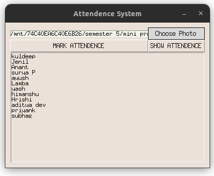
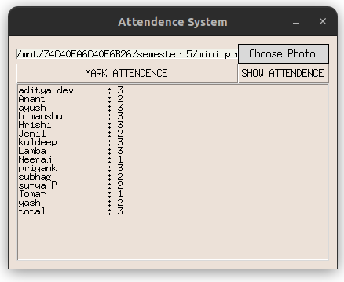

# face-recognition-attendance-system
This is the attendance system based on face recognition.

## Usage

Steps 1 to 4 are required to be done only once. Step 5 is to be done every time you want to mark attendance.

1. Install the required packages.
```
pip install -r requirements.txt
```

2. Put the images of the people to be recognized in the `dataset/person_name` folder.

3. Run `mark_attendance.py` to initialize the attendance sheet. 
```
python3 mark_attendance.py
```

4. Run `create_face_encoding.py` to create the face encodings of the images in the `dataset` folder.
```
python3 create_face_encoding.py
```

5. Finally attendance system is ready to mark attendence. Run `project_gui.py` to start the attendance system.
```
python3 project_gui.py
```

## Screenshots




